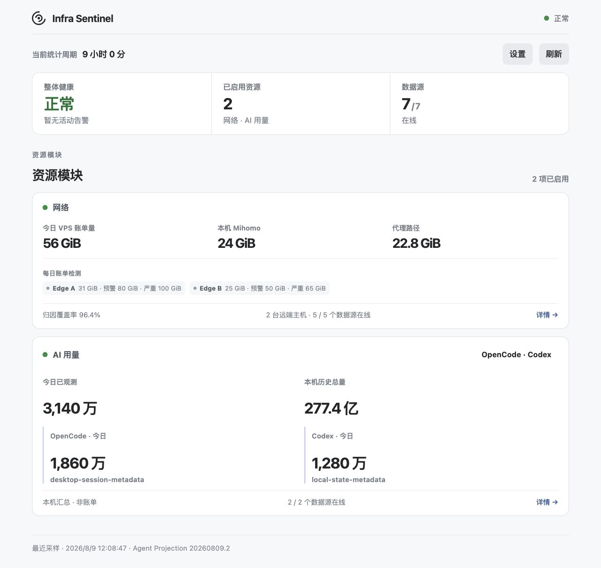
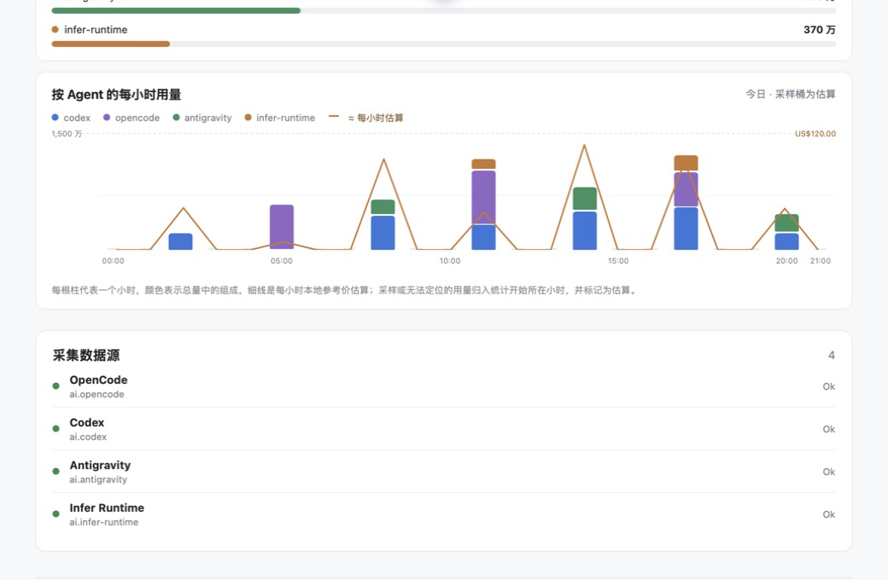
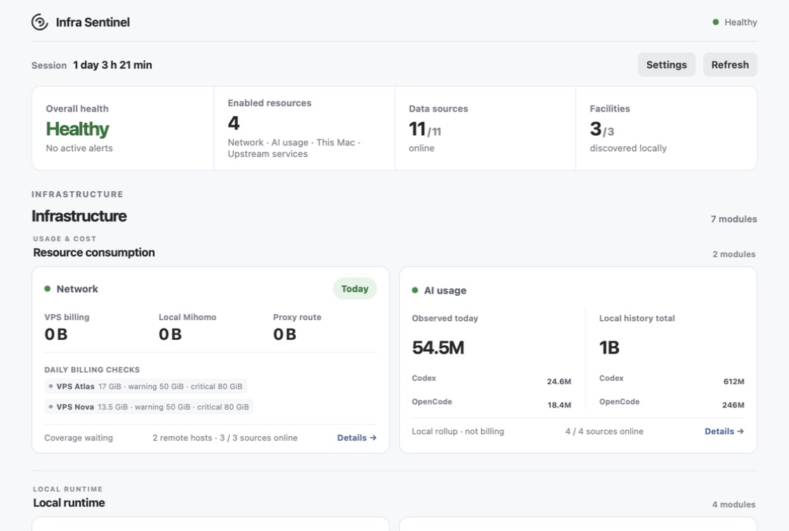
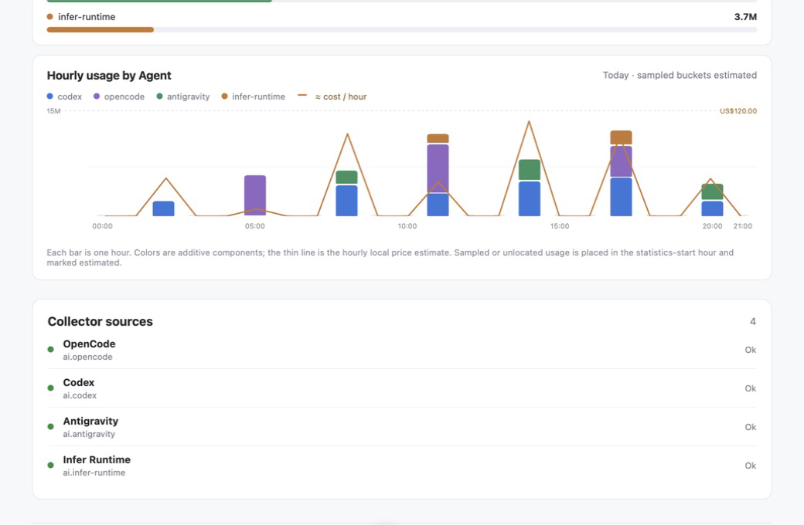

# Infra Sentinel

**中文** · [English](#english)

Infra Sentinel 是一个 macOS 桌面监控工具，用于查看网络流量、AI 客户端用量、本机资源、远端主机和服务状态。各类数据按来源和单位分别展示。



> 截图使用匿名演示数据，不含真实主机名、IP、账户、路径或项目内容。

## 支持范围

- **本机网络**：Mihomo / Clash Meta 兼容内核的连接、域名和代理路径归因。
- **AI 用量**：Codex 桌面端与 CLI、OpenCode Desktop、Antigravity、Antigravity IDE / CLI，以及已接入的 Infer Runtime。
- **本机资源**：CPU、内存压力、Swap、磁盘吞吐、IOPS、容量、温度压力，以及尽力而为的 App 磁盘 I/O 归因。
- **远端主机**：通过本机 `~/.ssh/config` Host 别名读取 Linux 网卡统计；可选接入 Xray 用户逻辑流量。
- **上游状态**：OpenAI、Claude、DeepSeek、Kimi / Moonshot 和 Cursor 的公开官方状态页。
- **本地设施**：通过 [Infra Protocol](https://github.com/glenzli/infra-protocol) 发现 PCP、Infer Runtime、Dev Mesh Observer 等兼容服务。

## 使用方式

启动 App 后，应用会管理本地采样进程；关闭主窗口后继续驻留菜单栏。首次启动会创建：

```text
~/Library/Application Support/Infra Sentinel/config.toml
```

Mihomo 默认自动发现。远端 VPS 在设置中填写已存在于 `~/.ssh/config` 的 Host 别名；App 只记录别名，不复制 SSH 密钥、密码或 `HostName`。

```sshconfig
Host edge-a
  HostName vps.example.com
  User root
  IdentityFile ~/.ssh/id_ed25519
```

Xray 用户统计为可选功能。每个客户端需要独立的 `email` 标签，StatsService 应只监听远端回环地址。

## AI 用量统计

Codex 用量从本机 rollout JSONL 中读取每次请求的 `last_token_usage` 增量，不使用 `threads.tokens_used` 计算。统计会排除 fork 回放和跨文件重复记录。持久化数据只包含聚合用量、解析状态和去重标记，不包含任务内容。

图表显示本机记录到的原始 Token，不是 Codex 账户额度或账单。API 参考价值按模型的输入、缓存输入、缓存写入和输出价格换算。

当日用量按小时展示。有时间戳的来源按事件时间归桶；只提供累计值的来源按采样差分归桶。无法定位的起始余额归入统计开始所在小时，并标记为估算。跨日后按自然日汇总。



*当日 Token 小时桶与本地 API 参考价值；图中为匿名演示数据。*

从旧版本升级时，Agent 会先备份旧 SQLite 和 Codex 检查点，重建当前仍可见的 Codex 历史，再替换旧的 Codex 指标。已记入聚合账本的历史不受后续删除任务影响；其他机器和升级前已删除的任务无法补录。

如需核对本机仍可见的 Codex JSONL，可从源码运行只读审计：

```sh
PYTHONPATH=src python3 -m infra_sentinel.cli.codex_usage_audit \
  --from 2026-08-22 --to 2026-08-23 --timezone Asia/Shanghai
```

## 安装与构建

当前桌面包支持 macOS 13+。预编译 App 使用 ad-hoc 签名，未经 Apple 公证；首次启动如被 macOS 拦截，可右键选择“打开”，或在“系统设置 → 隐私与安全性”中确认。

从 Traffic Sentinel 1.0.0 升级时，macOS 会把 Infra Sentinel 识别为独立 App。首次启动仅在新版配置不存在时复制旧的 `Traffic Sentinel/config.toml`；旧目录不会被删除，v1 的历史采样也不会导入新版指标库。

从源码构建需要 Xcode Command Line Tools、Rust、Node.js LTS、Python 3.11+ 与 PyInstaller：

```sh
git clone git@github.com:glenzli/infra-sentinel.git
cd infra-sentinel
python3 -m pip install pyinstaller
./bin/build-desktop-app.sh
open "ui/src-tauri/target/release/bundle/macos/Infra Sentinel.app"
```

## 数据与隐私

采集为只读操作：不抓包，不采集或保存提示词、响应、项目文件和凭据，也不修改代理或远端服务配置。上游状态检查只访问供应商的公开状态页。

本地状态保存在：

```text
~/Library/Application Support/Infra Sentinel/state/
```

状态数据可能包含聚合域名、模型名、Xray 客户端标签和用户设置的显示名。默认情况下，采集、存储和分析均在本机完成。

实现与架构说明见 [docs](docs/)、[ROADMAP.md](ROADMAP.md) 和 [设施发现说明](docs/facility-discovery.md)。

## 开发验证

```sh
python3 -m unittest discover -s tests -v
cd ui && npm run build
cd src-tauri && cargo test --offline
```

---

## English

[中文](#infra-sentinel)

Infra Sentinel is a macOS desktop monitor for network traffic, local AI-client usage, host resources, remote hosts, and service status. Each source keeps its own units and accounting method.



### Supported sources

- **Local network**: connection, domain, and proxy-route attribution from Mihomo / Clash Meta-compatible cores.
- **AI usage**: Codex desktop and CLI, OpenCode Desktop, Antigravity, Antigravity IDE / CLI, and connected Infer Runtime instances.
- **Host resources**: CPU, memory pressure, swap, disk throughput, IOPS, capacity, thermal pressure, and best-effort per-app disk I/O attribution on macOS.
- **Remote hosts**: Linux interface counters through an existing SSH Host alias, with optional Xray per-user logical traffic.
- **Provider status**: public status pages for OpenAI, Claude, DeepSeek, Kimi / Moonshot, and Cursor.
- **Local facilities**: PCP, Infer Runtime, Dev Mesh Observer, and other compatible services discovered through [Infra Protocol](https://github.com/glenzli/infra-protocol).

### Running the app

The app manages the local sampling process and remains in the menu bar after its main window closes. On first launch it creates:

```text
~/Library/Application Support/Infra Sentinel/config.toml
```

Mihomo is discovered automatically. Remote hosts are configured by an existing `~/.ssh/config` Host alias; Infra Sentinel records the alias without copying SSH keys, passwords, or `HostName`. Xray user statistics are optional and require a separate `email` label for each client. StatsService should listen only on the remote loopback interface.

### AI usage accounting

Codex usage is calculated from per-request `last_token_usage` increments in local rollout JSONL. `threads.tokens_used` is not used. Fork replay and duplicate records across files are removed. The persistent ledger contains aggregate usage, parser state, and deduplication markers, but no task content.

Charts show raw Tokens recorded on this machine, not Codex account quota or billing. API reference value is calculated from model-specific input, cached-input, cache-write, and output prices.

The current day is displayed in hourly buckets. Timestamped sources use event time; cumulative-only sources use sampled deltas. An opening balance that cannot be located is assigned to the statistics-start hour and marked as estimated. Older data is summarized by calendar day.



*Hourly Token buckets and local API reference value for the current day, using anonymous demo data.*

When upgrading from the legacy accounting format, the Agent backs up the old SQLite store and Codex checkpoints, rebuilds the Codex history still visible on this machine, and replaces the old Codex metrics. History already captured in the aggregate ledger remains after a task is deleted. Data from other machines and tasks deleted before the upgrade cannot be recovered.

To audit the Codex JSONL still visible on this machine:

```sh
PYTHONPATH=src python3 -m infra_sentinel.cli.codex_usage_audit \
  --from 2026-08-22 --to 2026-08-23 --timezone Asia/Shanghai
```

### Build

The desktop package supports macOS 13+. Prebuilt apps use ad-hoc signing and are not notarized by Apple. Building from source requires Xcode Command Line Tools, Rust, Node.js LTS, Python 3.11+, and PyInstaller:

When upgrading from Traffic Sentinel 1.0.0, macOS treats Infra Sentinel as a separate app. On first launch it copies the old `Traffic Sentinel/config.toml` only when no Infra Sentinel configuration exists. The legacy directory is retained, and v1 sample history is not imported into the new metric store.

```sh
git clone git@github.com:glenzli/infra-sentinel.git
cd infra-sentinel
python3 -m pip install pyinstaller
./bin/build-desktop-app.sh
open "ui/src-tauri/target/release/bundle/macos/Infra Sentinel.app"
```

### Data and privacy

Collection is read-only. Infra Sentinel does not capture packets or retain prompts, responses, project files, or credentials. It does not change proxy or remote-service configuration. Provider-status checks access only public status pages.

Local state is stored under:

```text
~/Library/Application Support/Infra Sentinel/state/
```

It may include aggregated domains, model names, Xray client labels, and user-defined display names. Collection, storage, and analysis run locally by default.

Implementation and architecture notes are under [docs](docs/), [ROADMAP.md](ROADMAP.md), and [facility discovery](docs/facility-discovery.md).

### Development checks

```sh
python3 -m unittest discover -s tests -v
cd ui && npm run build
cd src-tauri && cargo test --offline
```
