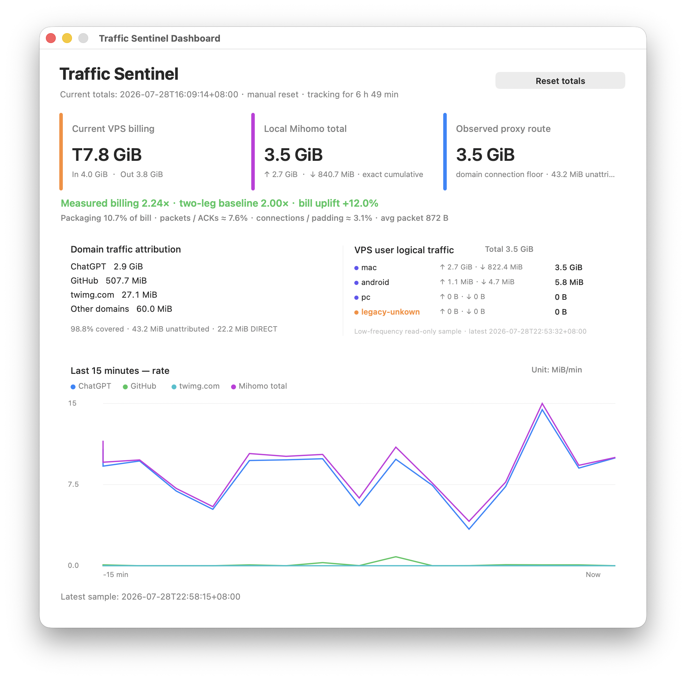

# Traffic Sentinel

Traffic Sentinel 是一个只读的 macOS 菜单栏流量分析工具，服务于一条明确的代理技术栈：

- 本地使用 Mihomo / Clash Meta 兼容内核；
- 可选通过 SSH 对账 Linux VPS 网卡流量；
- 可选读取 Xray StatsService 的用户逻辑流量。

它按域名和实际代理链归因本机流量，并把 Xray 逻辑流量与 VPS 账单流量放到同一个统计周期中比较。

它不会抓包、读取请求内容或提示词、记录 URL 路径、终止进程、删除业务文件或断网。



> 图中的设备标签来自使用者自己的 Xray 配置，不是程序内置名称。

## 支持范围

当前正式支持：

- macOS；
- 当前用户拥有的 Mihomo Unix Socket；
- Clash Verge 服务模式在受控 `/tmp/verge` 目录下创建的 root-owned Socket；
- 兼容的只读 `/connections` API；
- 通过 `~/.ssh/config` 主机别名访问的 Linux VPS；
- Linux `/sys/class/net` 网卡累计计数；
- 仅监听远端 `127.0.0.1:10085` 的 Xray StatsService。

当前不支持：

- 任意 TCP Controller；
- sing-box、Surge 或其他代理核心；
- 非 Linux 远端网卡统计；
- 非 Xray 服务端用户统计；
- 自定义 Xray API 地址、二进制路径或 VPS 网卡选择。

接口偶然兼容不等于正式支持。项目只为上面的路径维护实现和测试。

## 统计口径

App 自动发现本地 Mihomo Socket，并读取 `/connections`：

- `Mihomo 本机总量`：`uploadTotal + downloadTotal` 的相邻增量；
- `域名流量归因`：持续跟踪活跃连接 ID，并按站点主域聚合；
- `代理路径`：根据连接 `chains` 区分代理、`DIRECT`、阻断和未知路径；
- `未归因`：总增量减去已观察连接增量，通常来自两个轮询点之间结束的短连接。

始终满足：

```text
所有域名分类 + 未归因 = Mihomo 精确总增量
代理路径 + DIRECT + 阻断 + 未知路径 + 未归因 = Mihomo 精确总增量
```

每个 5 秒展示周期内，本地 Socket 默认每 250ms 读取一次，以提高多 Agent 短连接的归因覆盖。这些读取只发生在本机，不产生外网流量。单次响应上限为 64 MiB。

内置的宽泛服务标签包括：

- OpenAI / ChatGPT 相关主域 → `ChatGPT`
- Google 相关主域 → `Google`
- GitHub 相关主域 → `GitHub`
- 其他域名按站点主域动态显示

Google 流量不会被推断为某个具体客户端。未知域名也会直接显示，不需要维护规则。

## 设置

从菜单栏或仪表板点击“设置”即可编辑全部用户配置。保存后，监控子进程会自动按新配置重新启动。

设置项只有：

- 警告窗口与单方向流量阈值；
- 严重窗口与上下行合计阈值；
- 是否启用 Linux VPS 远端对账；
- `~/.ssh/config` 中的主机别名；
- 是否读取 Xray 用户逻辑流量；
- VPS 计费周期开始日；
- VPS 收发均计费（2.0×）或仅出站计费（1.0×）。

以下行为固定，不进入配置：

- 本地展示周期 5 秒；
- 本地连接读取间隔 250ms；
- VPS 与 Xray 远端读取间隔 5 分钟；
- VPS 网卡自动发现；
- Xray StatsService 地址 `127.0.0.1:10085`；
- Xray 二进制路径 `/usr/local/bin/xray`；
- 日志单文件 10 MiB、保留 5 份归档。

配置文件由设置界面管理：

```text
~/Library/Application Support/Traffic Sentinel/config.toml
```

当前 schema：

```toml
[monitor]
warning_window_minutes = 5
warning_mib = 250
critical_window_minutes = 10
critical_mib = 1024

[remote]
enabled = false
ssh_host = ""
xray_stats_enabled = false
billing_cycle_start_day = 1
billing_mode = "both"
```

配置只接受当前 schema，不做历史格式迁移。版本控制保留历史，运行时代码不背负旧配置分支。

## VPS 与 Xray 对账

先在 `~/.ssh/config` 定义主机，再把 `Host` 后的别名填入设置页；默认不预设任何服务器：

```sshconfig
Host my-vps
  HostName vps.example.com
  User root
  IdentityFile ~/.ssh/id_ed25519
```

App 只保存 `my-vps` 这个别名，不保存密钥、密码或主机地址。

VPS 读取：

```text
/sys/class/net/<interface>/statistics/rx_bytes
/sys/class/net/<interface>/statistics/tx_bytes
/sys/class/net/<interface>/statistics/rx_packets
/sys/class/net/<interface>/statistics/tx_packets
```

Xray 分端统计只需：

1. 给每个 `clients[]` 项设置唯一的 `email` 标签和 `level: 0`；
2. 启用用户上下行统计及只监听回环地址的 StatsService；
3. 重启 Xray，并在设置页勾选 Xray 统计。

```json
{
  "inbounds": [{
    "settings": {
      "clients": [
        {"id": "<uuid-1>", "email": "mac", "level": 0},
        {"id": "<uuid-2>", "email": "phone", "level": 0}
      ]
    }
  }],
  "stats": {},
  "policy": {
    "levels": {
      "0": {
        "statsUserUplink": true,
        "statsUserDownlink": true
      }
    }
  },
  "api": {
    "tag": "api",
    "listen": "127.0.0.1:10085",
    "services": ["StatsService"]
  }
}
```

收发均计费时：

```text
VPS 账单量     = RX + TX
理想账单量     = Xray 用户逻辑流量 × 2
实测账单倍率   = VPS 账单量 ÷ Xray 用户逻辑流量
账单附加量     = max(0, VPS 账单量 − 理想账单量)
```

仅出站计费时，VPS 账单量使用 `TX`，理想倍率为 `1×`。

账单附加量可能包含两条链路的 IP/TCP 头与 ACK、连接建立、REALITY/Vision 填充、重传和少量 VPS 背景流量。包数拆分是不抓包条件下的近似解释，不是精确丢包率。

## 菜单栏、仪表板与告警

菜单栏格式类似：

```text
⌁ T2.9 GiB · ChatGPT 8.4 MiB/s
```

- 启用 VPS 时，`T` 使用当前计费方式计算 VPS 账单量；
- 未启用 VPS 时，`T` 是当前统计周期的 Mihomo 本机总量；
- 后半部分显示当前区间流量最大的域名服务及速率。

仪表板显示 VPS 账单、本机 Mihomo 总量、代理路径、域名归因、Xray 用户统计和最近 15 分钟的 `MiB/min` 趋势。界面支持中文和 English 即时切换。

默认告警：

- 5 分钟单方向超过 250 MiB：警告；
- 10 分钟上下行合计超过 1 GiB：严重。

App 或采样器中断后的累计差额仍进入本周期总量，但标记为补记，不进入实时告警和速率趋势。点击通知会打开仪表板。

## 隐私

证据快照和状态文件只保存累计字节、聚合域名、代理路径、覆盖率和远端计数。不会保存：

- URL 路径或查询参数；
- 请求头、请求正文或响应正文；
- 提示词、命令或文件内容；
- 抓包数据。

## 构建与开发

项目不要求 Apple Developer 证书。可以下载标明系统与架构要求的预编译 App，也可以在自己的 Mac 上构建：

- macOS 13 或更高版本；
- Xcode Command Line Tools；
- Python 3.11 或更高版本。

预编译 App 使用 ad-hoc 签名、未经 Apple 公证，Release 会明确标注最低 macOS 版本、CPU 架构和 Python 要求。macOS 如阻止首次启动，可在系统设置中确认后打开。

```sh
git clone git@gitlab.com:glenzli/net-traffic-sential.git
cd net-traffic-sential
./bin/build-menubar-app.sh
open "Traffic Sentinel.app"
```

构建脚本会生成适配当前 Mac 架构的 `Traffic Sentinel.app`，复制 Python 模块并执行本机 ad-hoc 签名。

运行测试：

```sh
python3 -m unittest discover -s tests -v
./bin/build-menubar-app.sh
```
